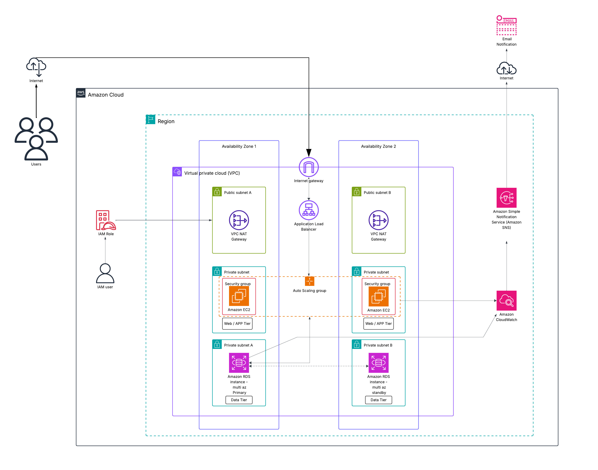

# 🚀 Scalable 2-Tier Web Application on AWS

This project demonstrates how to deploy a scalable and highly available 2-tier web application on AWS using EC2, ALB, Auto Scaling, RDS, IAM, CloudWatch, and SNS.

## 📌 Architecture
- **Tier 1:** Web + App (EC2 + ASG + ALB)
- **Tier 2:** Database (RDS Multi-AZ).
- The setup also includes CloudWatch + SNS for monitoring and alerting.

## 🏗️ Architecture Diagram 

### Components: 
- VPC with public and private subnets across two Availability Zones (AZs).
- Internet Gateway for external access.
- NAT Gateway in public subnets for private instances to securely reach the internet.
- Application Load Balancer (ALB) to distribute traffic across EC2 instances.
- EC2 Auto Scaling Group (ASG) to automatically scale the web/application servers.
- Amazon RDS (Multi-AZ) for database high availability.
- IAM Roles for secure AWS resource access.
- CloudWatch + SNS for monitoring and alerting. 

## ⚙️ Deployment Steps

### 1. Networking (VPC & Subnets)
- Create a VPC with CIDR block (e.g., 10.0.0.0/16).
- Create 2 public subnets (for ALB + NAT Gateway).
- Create 2 private subnets (for EC2 + RDS).
- Attach an Internet Gateway to the VPC.
- Add NAT Gateways for outbound internet access from private instances. 
### 2. Security Groups
- ALB Security Group → Allow inbound HTTP/HTTPS from the internet.
- EC2 Security Group → Allow inbound traffic from ALB only.
- RDS Security Group → Allow inbound traffic from EC2 only. 
 ### 3. Application Load Balancer (ALB)
- Deploy ALB in public subnets.
- Configure listeners (HTTP/HTTPS).
- Target group → EC2 instances in private subnets.
### 4. EC2 Auto Scaling Group (Web/App Tier)
- Create a Launch Template with AMI, instance type, and user data script.
- Place EC2 instances in private subnets.
- Attach to an Auto Scaling Group (ASG) with scaling policies (e.g., CPU > 70%).
### 5. Database (Amazon RDS – Data Tier)
- Deploy RDS in Multi-AZ mode for high availability.
- Place in private subnets.
- Choose engine (MySQL/PostgreSQL, etc.).
- Allow access only from EC2 security group.

## 📊 Monitoring & Alerting
### 🔹 Amazon CloudWatch
Collects metrics and logs.

Key Metrics to monitor:
- EC2 → CPU Utilization, Memory, Disk.
- ALB → Request count, Latency, 4xx/5xx errors.
- RDS → Free Storage, Connections, Latency.
### 🔹 Amazon SNS
- Integrated with CloudWatch Alarms.
- Sends email notifications to admins when alarms trigger.

Workflow:
- EC2, ALB, and RDS send metrics → CloudWatch.
- CloudWatch Alarms check thresholds.
- Alarms trigger SNS Topic. 
- SNS sends Email Notification to admin.
